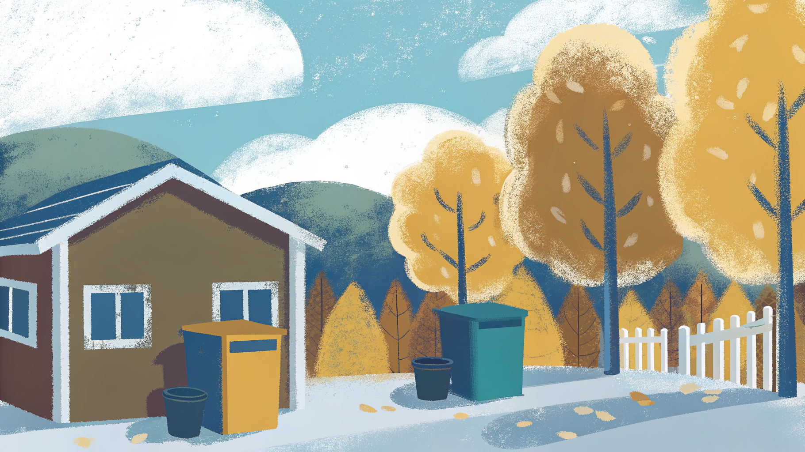

<p align="center">
  
</p>

<h1 align="center">Henteplan</h1>

<p align="center">
  Open API for Norwegian waste collection schedules.<br>
  Look up pickup dates by address across 200+ municipalities.
</p>

<p align="center">
  <a href="https://henteplan.no"></a>&nbsp;
  <a href="https://github.com/henrikkvamme/henteplan/actions/workflows/smoke-tests.yml"></a>&nbsp;
  <a href="LICENSE"></a>
</p>

<p align="center">
  <a href="https://henteplan.no/docs"><b>API Docs</b></a> · <a href="https://henteplan.no">Web App</a> · <a href="docs/PROVIDERS.md">Provider Coverage</a>
</p>

---

- **13 providers** — Norkart, BIR, Oslo, TRV, ReMidt, IRIS, and more
- **265+ municipalities** covered across Norway
- **iCal feeds** — subscribe in any calendar app
- **Auto-detect** — resolve provider from address or postal code

---

## API

Base URL: `https://henteplan.no/api/v1`

| Endpoint | Description |
|---|---|
| `GET /providers` | List all providers and their municipalities |
| `GET /detect?postalCode=...` | Auto-detect provider from postal code |
| `GET /search?provider=...&q=...` | Search addresses within a provider |
| `GET /schedule?provider=...&locationId=...` | Get pickup schedule |
| `GET /schedule.ics?provider=...&locationId=...` | iCal feed |

```sh
# Example: find the next pickups for an address in Trondheim
curl "https://henteplan.no/api/v1/search?provider=trv&q=Kongens+gate+1"
```

Interactive docs at [henteplan.no/docs](https://henteplan.no/docs).

<details>
<summary><strong>Supported providers (13)</strong></summary>

<br>

| Provider | Municipalities | Integration |
|---|---|---|
| Norkart (MinRenovasjon) | ~198 | REST / Azure proxy |
| ReMidt | 18 | renovasjonsportal.no |
| BIR | 10 | REST + token auth |
| Innherred Renovasjon | 10 | WordPress REST |
| IRIS Salten | 9 | Session-based PHP |
| HIM | 7 | WordPress REST |
| RfD | 5 | Enonic XP |
| Fosen Renovasjon | 3 | renovasjonsportal.no |
| Avfall Sor | 2 | WordPress REST |
| Renovasjonen IKS | 2 | JSON + HTML scraping |
| TRV | 1 | WordPress REST |
| Oslo | 1 | Geonorge + rules |
| FREVAR | 1 | ArcGIS REST |

See [`docs/PROVIDERS.md`](docs/PROVIDERS.md) for detailed coverage analysis.

</details>

## Setup

```sh
bun install
cp .env.example .env  # add your MAPBOX_ACCESS_TOKEN
bun dev
```

## Stack

[Bun](https://bun.sh) + [Hono](https://hono.dev) + [Zod OpenAPI](https://github.com/honojs/middleware/tree/main/packages/zod-openapi) + [Scalar](https://scalar.com) docs

## License

MIT
